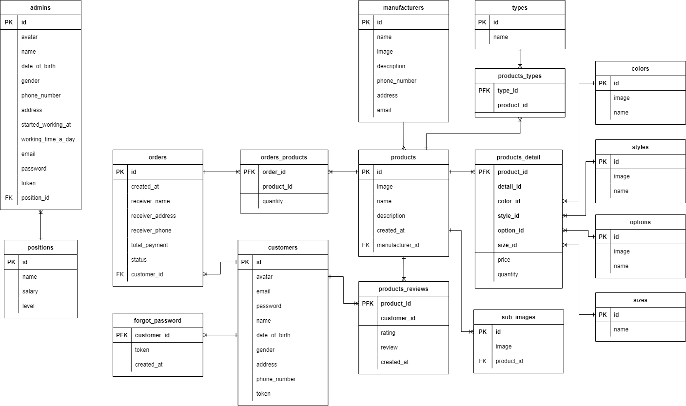

# FishingTackle Shop

[Developed by huyviet0110](https://www.linkedin.com/in/huy-nguyễn-733a23246)

### Entity Relationship Diagram

# All FishingTackle Shop features

### All actors
- Guest
- User
- Admin
- Super Admin

### A. Admin
- Order management: View orders, order processing (approve, delete)
- Customer management
- Product management
- Order statistics
- Product statistics

### B. Super Admin
- All admin features
- Manufacturer management
- Staff management

### C. Guest
- Live search
- Add to cart, view cart
- Sign up, sign in, forgot password

### D. User
- All guest features
- Rating & review
- Checkout
- Edit personal information
- View payment history

# How to use

With the HTML file, you can download and open it with any Browser right away. But with PHP file, you must watch this video to know [how to run PHP file](https://www.facebook.com/groups/j2team.community/permalink/709597696039020/)

### Feel free asking if there any bug or something you want me to do
Follow me or this git to see more

Technology I use

* HTML
* Bootstrap
* JavaScript
* jQuery
* PHP

# License

MIT
